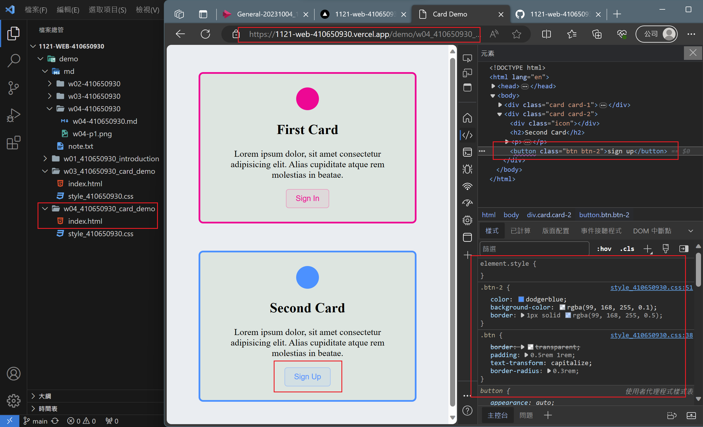
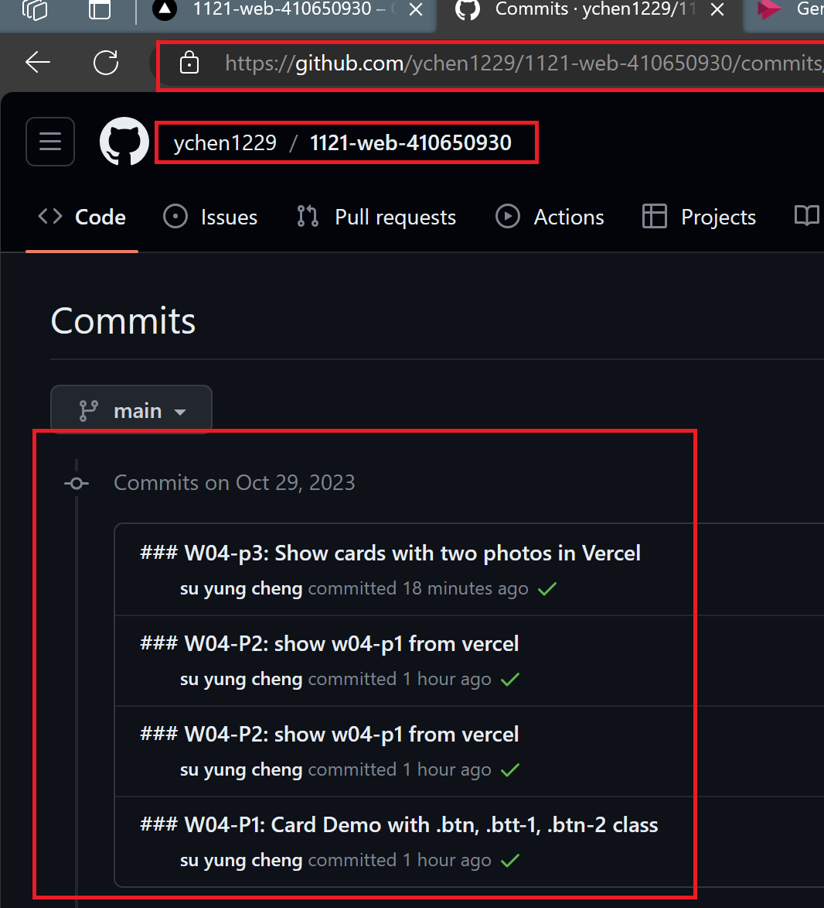

### W04-P1: Card Demo with .btn, .btt-1, .btn-2 class


 ```
 57e578d su yung cheng   Sat Oct 28 23:42:01 2023 +0800  
 W04-P1: Card Demo with .btn, .btt-1, .btn-2 class
 ```

 ### W04-P2: show w04-p1 from vercel with URL

 [W04-P2 Vercel URL](https://1121-web-410650930.vercel.app/demo/w04_410650930_card_demo/)
 
 

 ```
 fc517ef su yung cheng   Sun Oct 29 15:10:34 2023 +0800  ### W04-P2: show w04-p1 from vercel
 ```

### W04-p3: Show cards with two photos in Vercel

[W04-P3 Vercel URL](https://1121-web-410650930.vercel.app/demo/w04_410650930_card_demo/)


```
fbfb43f su yung cheng   Sun Oct 29 15:50:27 2023 +0800  
### W04-p3: Show cards with two photos in Vercel 
```

### W04-p4: W4 git logs



```
fbfb43f su yung cheng   Sun Oct 29 15:50:27 2023 +0800  ### W04-p3: Show cards with two photos in Vercel    
fc517ef su yung cheng   Sun Oct 29 15:10:34 2023 +0800  ### W04-P2: show w04-p1 from vercel
2b58096 su yung cheng   Sun Oct 29 15:02:11 2023 +0800  ### W04-P2: show w04-p1 from vercel
86c0562 su yung cheng   Sun Oct 29 14:48:08 2023 +0800  ### W04-P1: Card Demo with .btn, .btt-1, .btn-2 clas
```