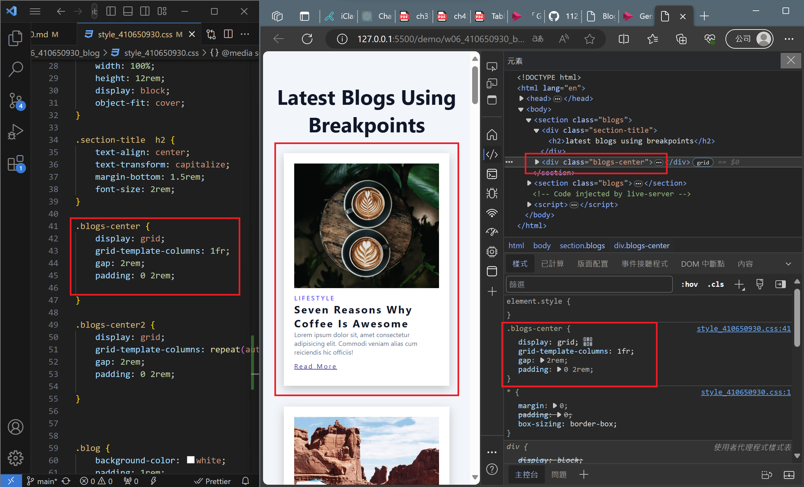

### W06-P1: Show nine photos
 

 
```
3c66b20 su yung cheng   Tue Oct 31 20:55:27 2023 +0800  ### W06-P1: Show nine photos
```
 

 ### W06-P2: Show responsive when breakpoint are <550px >=550px, >=800px
 

 

 

 
```
782aadd su yung cheng   Sun Nov 5 15:12:49 2023 +0800   W06-P2: Show responsive when breakpoint are <550px >=550px, >=800px
```


### W06-P3: Show responsive using minmax approach
 

 

 

 

 
```
5121bd0 su yung cheng   Wed Nov 1 14:25:24 2023 +0800   W06-P3: Show responsive using minmax approach
```
 
 ### W06-P4: Show responsive when breakpoint are >=992px, >=1200px, >=1400px
 

 

 

 
```
 
```


### W06-P5: W6 git logs


```

```
