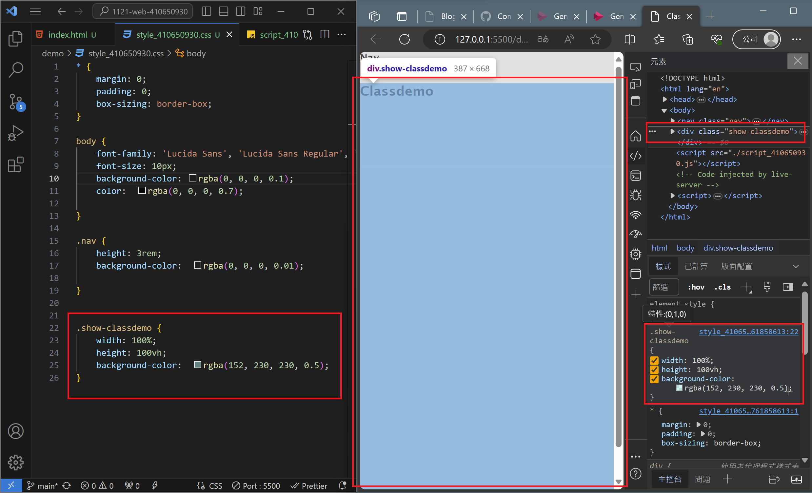
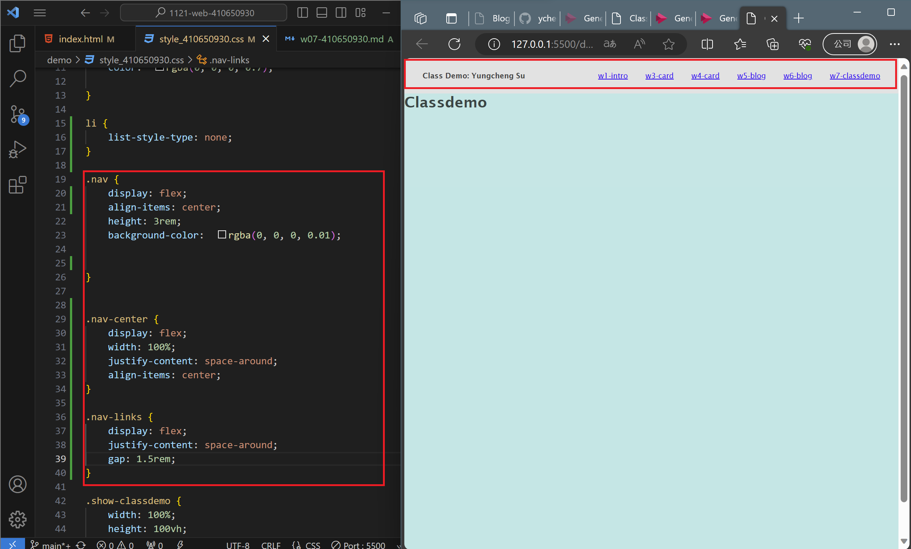
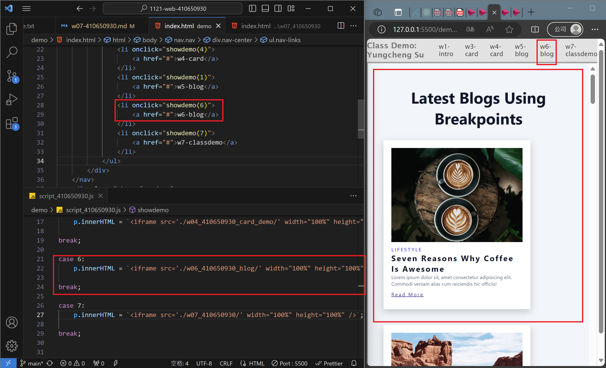
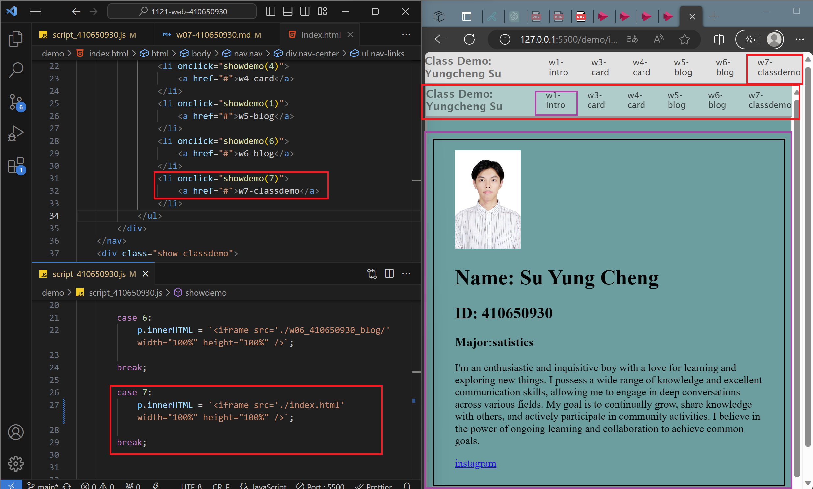
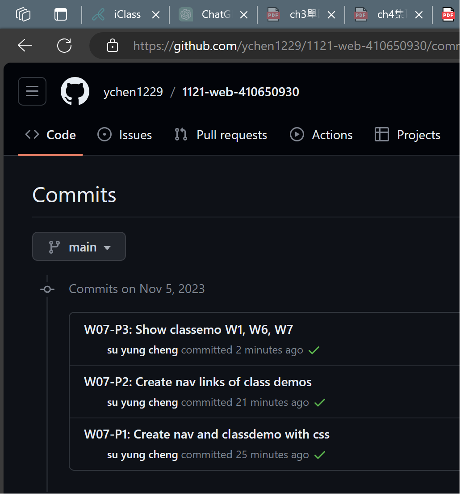

### W07-P1: Create nav and classdemo with css
 

 
```
3652293 su yung cheng   Sun Nov 5 14:40:03 2023 +0800   W07-P1: Create nav and classdemo with css
```

### W07-P2: Create nav links of class demos
 

 
```
8497e64 su yung cheng   Sun Nov 5 14:43:59 2023 +0800   W07-P2: Create nav links of class demos
```


### W07-P3: Show classemo W1, W6, W7
 

 

 
```
1b58684 su yung cheng   Sun Nov 5 15:03:25 2023 +0800   W07-P3: Show classemo W1, W6, W7
```

### W07-P4: W7 git logs
 

 
```
$ git log --pretty=format:"%h%x09%an%x09%ad%x09%s" --after="2023-11-4"
1b58684 su yung cheng   Sun Nov 5 15:03:25 2023 +0800   W07-P3: Show classemo W1, W6, W7
8497e64 su yung cheng   Sun Nov 5 14:43:59 2023 +0800   W07-P2: Create nav links of class demos
3652293 su yung cheng   Sun Nov 5 14:40:03 2023 +0800   W07-P1: Create nav and classdemo with css
 
```