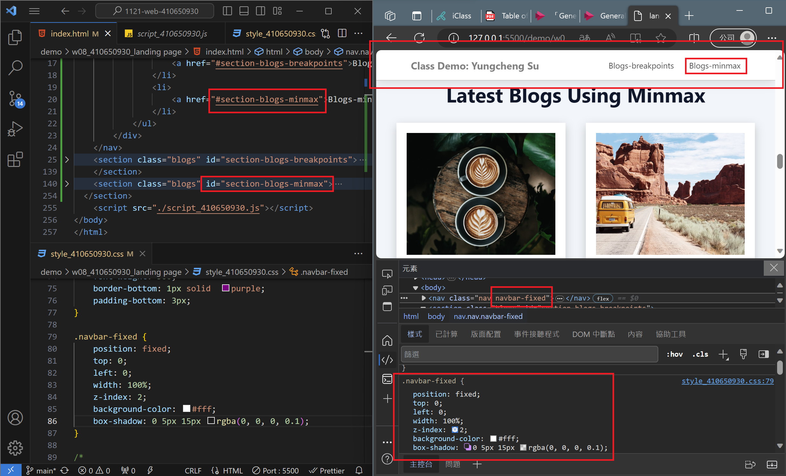
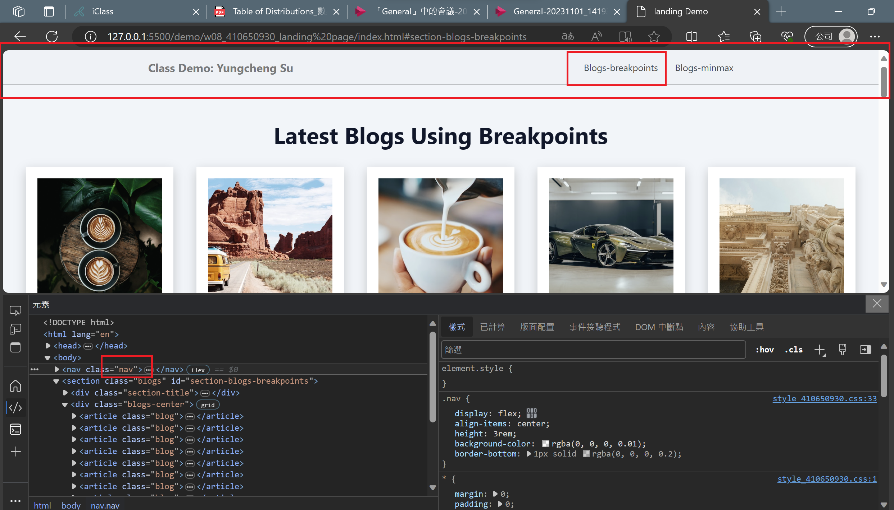
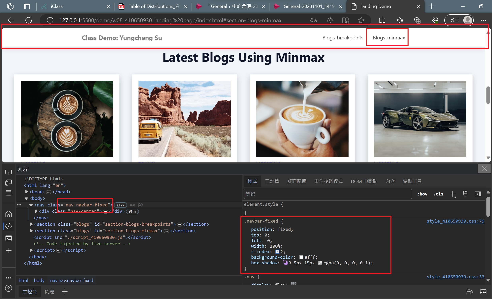
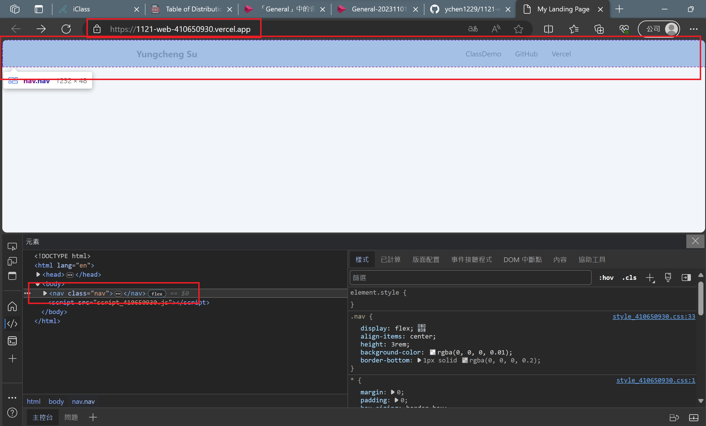
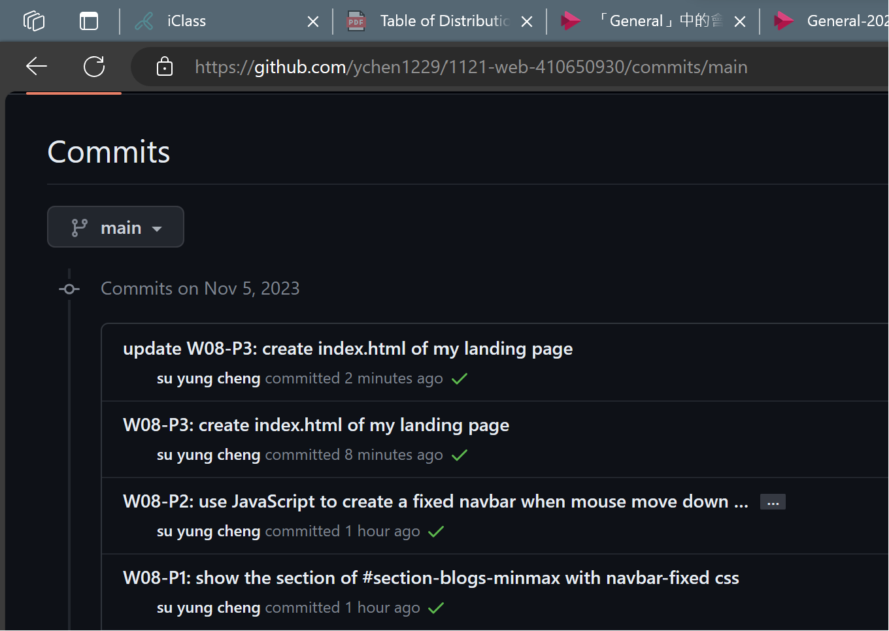

### W08-P1: show the section of #section-blogs-minmax with navbar-fixed css
 
 
```
df3f5f2 su yung cheng   Sun Nov 5 18:14:09 2023 +0800   W08-P1: show the section of #section-blogs-minmax with navbar-fixed css
```

### W08-P2: use JavaScript to create a fixed navbar when mouse move down to some extent, remove when original nav appears
 

 

 
```
8423be0 su yung cheng   Sun Nov 5 18:15:38 2023 +0800   W08-P2: use JavaScript to create a fixed navbar when mouse move down to some extent, remove when original nav appears
```

### W08-P3: create index.html of my landing page
 

 
```
 
```

### W08-P4: W8 git logs
 

 
```
87e857b su yung cheng   Sun Nov 5 20:04:06 2023 +0800   W08-P4: W8 git logs
b262010 su yung cheng   Sun Nov 5 19:59:04 2023 +0800   update W08-P3: create index.html of my landing page
5008536 su yung cheng   Sun Nov 5 19:53:02 2023 +0800   W08-P3: create index.html of my landing page
8423be0 su yung cheng   Sun Nov 5 18:15:38 2023 +0800   W08-P2: use JavaScript to create a fixed navbar when mouse move down to some extent, remove when original nav appears
df3f5f2 su yung cheng   Sun Nov 5 18:14:09 2023 +0800   W08-P1: show the section of #section-blogs-minmax with navbar-fixed css
```