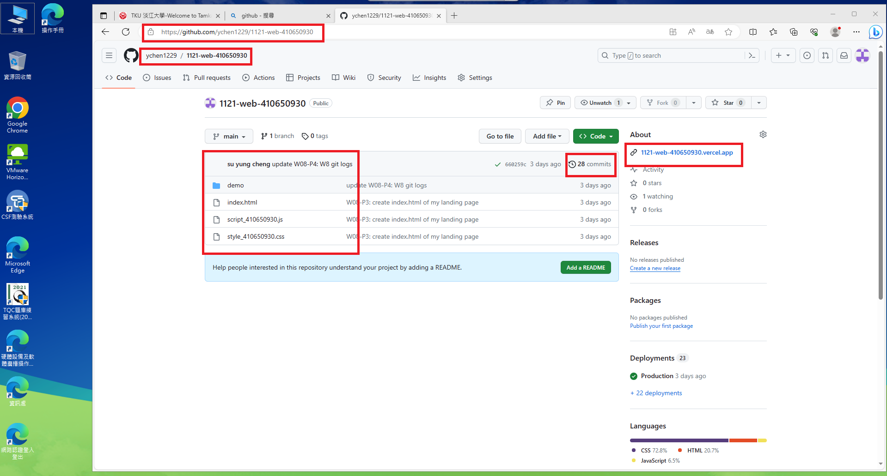

# (12.5%) 網頁程式設計 期中上機考-1 -- 開放網路

##### 2023-11-08, at B218

#### Note:

1. 請不要發揮同學愛，作弊雙方除了本次考試 0 分外，平常分數另扣 20 分。
2. iClass 上請繳交 w9_mid_xx.md, w19_mid_xx.pdf，還有所有程式壓縮檔 (zip)。
3. 老師將題目提供在 w9_mid_xx.md 檔案上，要實作的部分放在 w9_mid_htc.pdf 上，請依照老師實作的圖片在你自己的 Github repo, Vercel 上實作
4. 每一張圖片要有左側機房背景，圖片標註要跟老師所標註的類似。違者會依情節扣分。
5. 請自評分數，將每一題的 ? 填入分數，沒有填者，不會批改，以 0 分計算。

Your (Name, ID): (name, id)

##### P1 (30%): 基本題

- P1-1 (6%): ? 分
- P1-2 (6%): ? 分
- P1-3 (6%): ? 分
- P1-4 (6%): ? 分
- P1-5 (6%): ? 分

##### P2 (40%): 課堂實作延伸題 (card)

- P2-1 (20%): ? 分
- P2-2 (20%): ? 分

##### P3 (30%): 課堂實作延伸題 (選單)

- P3-1 (15%): ? 分
- P3-2 (15%): ? 分
- 總分: ? 分

---

## (30%) P1: 基本題

#### (6%) P1-1: Show Your Github Repo

[My Github Repo URL](https://github.com/ychen1229/1121-web-410650930)


#### (6%) P1-2: Show Your Github commits of week 8


#### (6%) P1-3: Show Your Vercel page for class demo of week 6 (minmax)

[My Vercel URL of demo W7]()


#### (6%) P1-4: Replace all filenames containing xx with your ID's last two digits, and show how the process of pushing it to Github


#### (6%) P1-5: Git log for P1


```
git log --pretty=format:"%h%x09%an%x09%ad%x09%s" --after="2023-11-07"


```

---

## (40%) P2: class demo 延伸題 -- card

Note: 原先老師放在 p1_xx.html 內的 class 不要更動，可新增其他 html,css 以回答本大題

#### (20%) P2-1: 請根據老師所給的 p1_xx.html，加入 6 張卡片，並設定 css grid，每一列顯示 4 張 cards，要將原本的 icon 改成圖片 photo-1.jpg ~ photo-6.jpg

##### => local


##### => Vercel


#### (20%) P2-2: 除了上課 demo 所用到的紅色、藍色，請多加一個綠色，讓邊框，按鈕顏色都屬於同一色系。請用變數來設定這三個色系之 color, background, border，以便使用時，能夠有一個整體一致的風格。P2-1 題的 color, border 偏淡，請重新調整，盡量接近下圖顏色。六張圖片分別以紅藍綠，紅藍綠色系之順序顯示如下圖。

Note: 請先將 p1_xx.html 內容複製到 p2_xx.html, p1_xx.css 複製到 p2_xx.css，本題答案要寫在 p2_xx.html, p2_xx.css 上。


---

## (30%) P3: class demo 延伸題 -- nav

#### (15%) P3-1: 請根據老師所給的 p3_xx.html，在 html 加入你的學號姓名，並加入 css，顯示選單如下圖

##### => 瀏覽器結果


##### => 顯示本題對應的 html, js 在同一張圖上


#### (15%) P3-2: 點選 P1_xx 能夠顯示 P2-1 題答案，點選 P2_xx 能顯示 P2_2 答案

##### => 點選 P2_xx


##### => 顯示本題對應的 html, js 在同一張圖上


